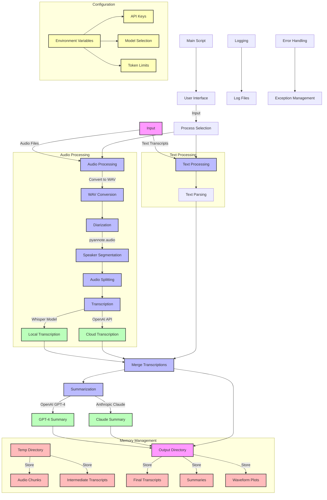

# NeverForgetNotes: Intelligent Meeting Assistant


NeverForgetNotes is an advanced audio processing and transcription pipeline designed to help you focus on the person across from you in meetings, rather than taking notes. This tool transcribes and analyzes audio recordings or text transcripts, providing diarized transcriptions and AI-generated summaries.

## Table of Contents

- [Features](#features)
- [System Architecture and Workflow](#system-architecture-and-workflow)
  - [High-Level Overview](#high-level-overview)
  - [Detailed Architecture](#detailed-architecture)
- [Installation](#installation)
- [Usage](#usage)
- [Configuration](#configuration)
- [Project Structure](#project-structure)
- [Modules](#modules)
- [Testing](#testing)
- [Logging](#logging)
- [Contributing](#contributing)
- [License](#license)
- [Meeting Summary Prompt Example](#meeting-summary-prompt-example)

## Features

- Supports various audio formats (M4A, WAV, MP3, etc.) and text transcript inputs
- Speaker diarization using pyannote.audio
- Transcription using Whisper (local) or OpenAI's API
- Flexible summarization options with OpenAI's GPT-4 or Anthropic's Claude
- Merged transcripts with speaker labels and timestamps
- Customizable prompts for tailored summaries
- Waveform visualization for audio files
- Progress tracking with rich console output
- Efficient handling of long audio files through chunking
- Robust error handling and logging

## System Architecture and Workflow

### High-Level Overview

The following diagram provides a simplified view of the NeverForgetNotes workflow:


This overview shows the basic flow from input to output, highlighting the main processing steps.

### Detailed Architecture

For a more comprehensive understanding of the system, including input/output processes, memory management, and AI models used, refer to the detailed diagram below:



This detailed architecture illustrates how NeverForgetNotes processes both audio and text inputs, performs diarization and transcription, and generates summaries using advanced AI models, all while efficiently managing system resources.

## Installation

1. Clone the repository:

   ```bash
   git clone https://github.com/veteranbv/NeverForgetNotes.git
   cd NeverForgetNotes
   ```

2. Create and activate a virtual environment:

   ```bash
   python -m venv venv
   source venv/bin/activate  # On Windows use `venv\Scripts\activate`
   ```

3. Install dependencies:

   ```bash
   pip install -r requirements.txt
   ```

4. Set up environment variables:
   Create a `.env` file in the project root and add:

   ```bash
   HF_AUTH_TOKEN=your_hugging_face_auth_token
   OPENAI_API_KEY=your_openai_api_key
   ANTHROPIC_API_KEY=your_anthropic_api_key
   OPENAI_MODEL=gpt-4-turbo
   OPENAI_MODEL_TOKEN_LIMIT=8000
   ANTHROPIC_MODEL=claude-3-5-sonnet-20240620
   ANTHROPIC_MODEL_TOKEN_LIMIT=100000
   ```

## Usage

1. Place audio files or text transcripts in the `audio/input` directory.

2. Run the main script:

   ```bash
   python main.py
   ```

3. Follow the interactive prompts to choose settings for:
   - Transcription method (OpenAI API or local Whisper)
   - Summarization model (GPT-4 or Claude)
   - Customized prompts for summarization
   - Custom recording details (optional)

4. The script will process each file, providing progress updates in the console.

5. Find outputs in the `output` directory, organized by date and recording name:
   - Transcriptions
   - Diarization results
   - Merged outputs (with speaker labels and timestamps)
   - AI-generated summaries
   - Waveform plots

## Configuration

Adjust settings in the `.env` file or when prompted during execution. You can customize:

- Transcription method (OpenAI API or local Whisper)
- Summarization model (GPT-4 or Claude)
- Prompts for summarization (stored in `prompts/library/`)
- Custom recording details (date and name)
- Token limits for AI models

## Project Structure

```bash
NeverForgetNotes/
├── app/
│   ├── audio_processing.py
│   ├── audio_utils.py
│   ├── diarization.py
│   ├── merge.py
│   ├── split.py
│   ├── summarize.py
│   ├── transcription.py
│   └── utils.py
├── audio/
│   ├── input/
│   ├── not_processed/
│   └── processed/
├── img/
├── logs/
├── output/
├── prompts/
│   └── library/
├── temp/
├── test/
│   ├── data/
│   └── create_testdata.py
├── .env
├── .gitignore
├── LICENSE
├── main.py
├── README.md
└── requirements.txt
```

## Modules

- `main.py`: Entry point, handles user interaction and orchestrates the processing pipeline
- `app/audio_processing.py`: Main processing pipeline for audio files and transcripts
- `app/audio_utils.py`: Audio file utilities (conversion, length calculation, waveform plotting)
- `app/diarization.py`: Speaker diarization using pyannote.audio
- `app/merge.py`: Merging transcriptions and diarization outputs
- `app/split.py`: Splitting audio by speaker segments
- `app/summarize.py`: Generating summaries using OpenAI or Anthropic models
- `app/transcription.py`: Audio transcription using Whisper or OpenAI's API
- `app/utils.py`: General utility functions (file operations, text processing, error handling)

## Testing

- Use the `test/create_testdata.py` script to generate shortened test audio files from your input data.
- Each module in the `app/` directory contains a `__main__` block for individual component testing.
- Run individual module scripts with sample data to test specific functionalities.

## Logging

- Logs are saved in the `logs/` directory.
- The application uses Python's `logging` module for comprehensive logging.
- Log files are automatically rotated and old logs are cleaned up to manage storage.
- Adjust logging settings in `main.py` if needed.

## Contributing

Contributions are welcome! Please follow these steps:

1. Fork the repository
2. Create a new branch for your feature or bug fix
3. Make your changes and commit them with clear, descriptive messages
4. Push your changes to your fork
5. Submit a pull request to the main repository

Please open an issue first for major changes or new features to discuss the proposed changes.

## License

This project is licensed under the [MIT License](LICENSE). See the LICENSE file for details.

## Meeting Summary Prompt Example

To generate a meeting summary, you can use the following prompt example and put it into a prompt.txt file in the prompts directory. The pipeline will use this prompt to generate a summary of the meeting transcript:

```markdown
Here is the transcript of the meeting:

<transcript>
{{TRANSCRIPT}}
</transcript>

Please read through the transcript carefully and complete the following steps:

1. Identify and extract the key points, decisions, action items (with owners if available), and any other critical information discussed during the meeting. 

2. Organize and categorize this extracted information into relevant sections such as main topics, decisions, action items, etc.

3. In the <scratchpad> section below, write out your thought process and the information you extracted, organized into appropriate categories:

<scratchpad>
(Write your thought process and extracted information here, organized into relevant categories)
</scratchpad>

4. Now, using the information in your scratchpad, please compose a concise yet comprehensive summary of the meeting that captures the essence and key outcomes. Structure and format the summary as follows:

---

**Meeting Summary for [Meeting Name] ([Date])**

**Quick Recap**

[Summary of main topics covered]

**Next Steps**

- [Owner] will [action item]
- [Owner] will [action item]
- [Owner] will [action item]

**Summary**

**[Topic 1]**

[Detailed discussion, decisions, and action items]

**[Topic 2]**

[Detailed discussion, decisions, and action items]

**[Topic 3]**

[Detailed discussion, decisions, and action items]

**[Additional Topics]**

[Any other critical information]

---

5. Please output your final summary inside <summary> tags.

<summary>
(Output your final summary here)
</summary>
```
